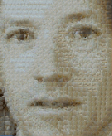
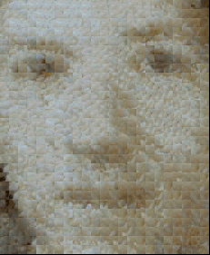

# Patch-based Texture Synthesis and Transfer

It's an implementation of `Efros and Freeman's "Image Quilting and Texture Synthesis", 2001`

The output depends on two factors : `PatchSize` and `OverlapWidth`
The running time depends on Sample Image dimensions, Desired Image dimensions, ThresholdConstant and PatchSize

## Texture Sythesis

```bash
python PatchBasedSynthesis.py /image/source.jpg Patch_Size Overlap_Width Initial_Threshold_error
```

for example

`python PatchBasedSynthesis.py textures/corn.jpg 30 5 78.0`

## Texture Transfer

```bash
python PatchBasedTextureTransfer.py {texture_image} {source_image}
```

Sample result
- Transfer texture (`textures/rice.png`) onto source image (`src.jpg`)

    - Patch-based

        
    - Patch-based with overlap cost

        
